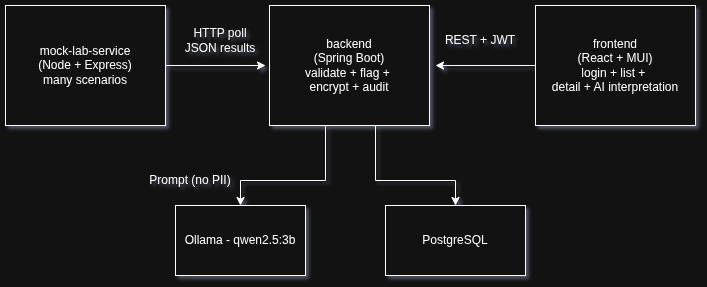

# LabAssist

A small hospital system that ingests test results from lab devices, lets a doctor review them,
flags abnormal values, and provides an **AI-assisted preliminary interpretation** with
password login, encryption of patient data, and an audit trail.


---

## System at a glance



| Component | Stack | Responsibility |
|---|---|---|
| `mock-lab-device/` | Node/Express + TypeScript | Simulates a lab analyzer; emits JSON results across many scenarios |
| `backend/` | Spring Boot 3.5 (Java 17, Maven) | Polls, validates, flags, encrypts, stores, serves the REST API, calls the LLM, audits |
| `frontend/` | React 18 + Vite + TypeScript + MUI | **Turkish** doctor dashboard: login, result list with abnormal highlighting, detail view, AI interpretation |
| `db` | PostgreSQL 16 + Flyway | Persistence + reproducible schema/seed |
| `llm` | Ollama (qwen2.5:3b) | Local, CPU-friendly preliminary interpretation |

More detail in [`docs/architecture.md`](docs/architecture.md) and the step-by-step
[`docs/usage-guide.md`](docs/usage-guide.md).

---

## Start with the usage guide

For a quick evaluation walkthrough, please start with the step-by-step
[`docs/usage-guide.md`](docs/usage-guide.md). It shows the intended reviewer flow with screenshots:

- sign in as doctor/admin,
- review lab results and abnormal/critical highlighting,
- open a report detail,
- request an AI preliminary interpretation,
- inspect the admin audit log.

---

## Quick start (Docker — one command)

Prerequisites: Docker + Docker Compose. The first run downloads the **~2 GB** `qwen2.5:3b` model into a named volume (subsequent runs reuse it).

```bash
cp .env.example .env          # secrets for JWT signing + PII encryption (already filled with dev values)
docker compose up --build     # postgres · ollama (+model pull) · mock · backend · frontend
```

Then open **<http://localhost:5173>** and sign in with a seeded account:

| Role | Username | Password |
|---|---|---|
| Doctor | `doctor` | `Doctor123!` |
| Admin (also sees the audit log) | `admin` | `Admin123!` |

The mock emits a new report every ~20 s (configurable via `MOCK_EMIT_INTERVAL_MS`), so the list
grows over time. To wipe accumulated data (and the model cache) and start fresh:

```bash
docker compose down -v
```

---

## REST API (overview)

All endpoints except login and Swagger require `Authorization: Bearer <jwt>`.

| Method | Path | Description |
|---|---|---|
| POST | `/api/auth/login` | Authenticate, receive a JWT |
| GET | `/api/auth/me` | Current user |
| GET | `/api/lab-reports` | Paged list; filters: `abnormalOnly`, `criticalOnly`, `status`, `q` (report id), `from`/`to` (date) |
| GET | `/api/lab-reports/summary` | Dashboard counts (scoped to the caller's visibility) |
| GET | `/api/lab-reports/{id}` | Report detail with analytes + flags (PII decrypted) |
| POST | `/api/lab-reports/{id}/interpretation` | Generate (or return cached) AI interpretation; `?refresh=true` to regenerate |
| GET | `/api/lab-reports/{id}/interpretation` | Latest stored interpretation (204 if none) |
| GET / POST | `/api/users` | List / create accounts — **ADMIN only** |
| GET | `/api/audit` | Audit trail — **ADMIN only** |

---

## Design decisions & rationale

**Stack**

- **Spring Boot 3.5 (not 4.0).** I pinned to the mature 3.5 LTS-aligned release for stability, broad library compatibility (springdoc, jjwt) and APIs I can confidently defend. Same reasoning drove **React 18 + MUI 6 + X-Data-Grid 7** instead of the just-released MUI 9. All more stable and reliable.
- **Java 17 + Maven wrapper**, **Vite + TypeScript**, **PostgreSQL + Flyway** — standard,
  reproducible, enterprise-familiar. Flyway owns the schema; JPA runs in `validate` mode.
- **Ollama + `qwen2.5:3b`.** Local, free, fully reproducible, and small enough to run on
  CPU-only (~2 GB). Chosen over llama3.2:3b specifically for its **stronger Turkish** (the AI
  commentary is shown to Turkish clinicians). Trade-off: a 3B model favors latency/footprint over
  depth. Swappable via `OLLAMA_MODEL`.
- **Turkish doctor UI.** LabAssist is a tool for a Turkish hospital, so the doctor-facing UI and the AI interpretation are in **Turkish** (dates in `tr-TR`, Turkish patient names).
- **Node/Express mock** as a *separate* service it represents an external analyzer the backend
  polls over HTTP, so a distinct process was more reasonable here and in the future can be replkaced with a real device integration without affecting the backend's internal logic.

**Business logic & AI**

- **The backend owns abnormality flagging.** It recomputes every flag from its **own seeded
  reference-range catalog** (including sex-specific ranges, e.g. hemoglobin) rather than trusting
  the ranges a device sends.
- **Hybrid analysis.** A deterministic rule engine (`AbnormalityEvaluator`) decides what is
  `NORMAL/LOW/HIGH/CRITICAL_*`; the LLM only *narrates* a preliminary interpretation grounded in
  those pre-computed flags. The system is never directly depends on the model, and flags are
  reproducible and testable.
- **Privacy by design, no PII to the LLM.** The prompt contains only age, sex, analyte values,
  reference ranges and flags. Patient **name and MRN are never sent to the model** (unit-tested).
- **Safety framing.** The system prompt forbids definitive diagnosis, leads with critical values,
  and always ends recommending doctor review. UI shows disclaimer.

**Resilience & correctness (ingestion)**

- Scheduled poll with an in-memory cursor; **idempotent on `external_id`** (duplicates skipped).
- **Each message is validated and persisted in its own transaction**, so one bad message never
  aborts the batch. Malformed payloads → `REJECTED` (raw payload + reason kept); missing values →
  `PARTIAL`; otherwise `VALIDATED`.
- Device errors / timeouts / empty batches are logged and retried next cycle with the cursor
  untouched — no data loss. The mock deliberately injects all of these.

**Security, encryption & audit**

- **JWT (HS256) + BCrypt**, stateless sessions, CORS limited to the SPA origin, role-based access
  (`DOCTOR` / `ADMIN`), consistent JSON `401/403/404` responses.
- **Field-level encryption of PII at rest.** Patient name and MRN are encrypted with
  **AES-256-GCM** (authenticated) via a JPA `AttributeConverter`; ciphertext in the DB, transparent decryption only for authorized API responses. Verified at-rest in an integration test.
- **Audit trail in a dedicated `audit_log` table** (the brief's "logging system"): login
  success/failure, ingestion polls, report views, LLM requests and account creation — with an admin viewer. Audit writes use `REQUIRES_NEW` so they persist independently of the business transaction.
- **Role-scoped visibility & provisioning.** Doctors see only clinically-valid reports; malformed
  `REJECTED` ones are admin-only (a data-quality concern). There is **no public signup** — accounts are provisioned by an admin (`/api/users`), which fits a clinical system.

**LLM endpoint**

- Persists **every** attempt (`SUCCESS/FAILURE/TIMEOUT`) for auditability, **caches** the latest
  success (regenerate with `?refresh=true`), is **not** wrapped in a DB transaction during the
  slow call, and maps runtime failures to a clear **503**.

---

## What I deliberately did not do (and why)

- **Streaming LLM responses** — would improve perceived latency; non-streaming kept the contract
  simple.
- **Refresh tokens / revocation** — a single short-lived access token is enough for this scope.
- **Searchable encrypted fields** — because name/MRN are encrypted at rest, free-text search is by report id only. A blind index would enable encrypted-field search at the cost of complexity.
- **Frontend test suite** — testing effort was concentrated on the backend (where the business
  logic lives); only high-value paths are covered.
- **Real device protocol** — the mock speaks JSON; a production integration would
  parse the real wire format.
- **Queue-based ingestion (e.g. Kafka)** — a single scheduled poller is
  sufficient at this scale.

---

## Testing

- **Unit (JUnit 5 + Mockito):** abnormality flagging, AES-GCM encryption, JWT, the de-identified
  prompt (asserts no PII leaks), reference-range selection.
- **Integration (Testcontainers + real PostgreSQL):** the full ingestion path
  (validate → flag → encrypt → persist, incl. critical / partial / malformed / duplicate and
  PII-ciphertext-at-rest), and the API/security/LLM endpoints over MockMvc (Ollama mocked).

`cd backend && ./mvnw test` → 32 tests, all green.

---

## Repository layout

```
labassist/
├── mock-lab-device/   # Node/Express/TS — lab device simulator (scenarios + chaos)
├── backend/           # Spring Boot — ingestion, REST API, auth, crypto, LLM, audit
├── frontend/          # React + Vite + MUI — doctor dashboard
├── docs/              # architecture, usage guide, screenshots
├── docker-compose.yml # full stack, one command
└── .env.example       # config template
```
