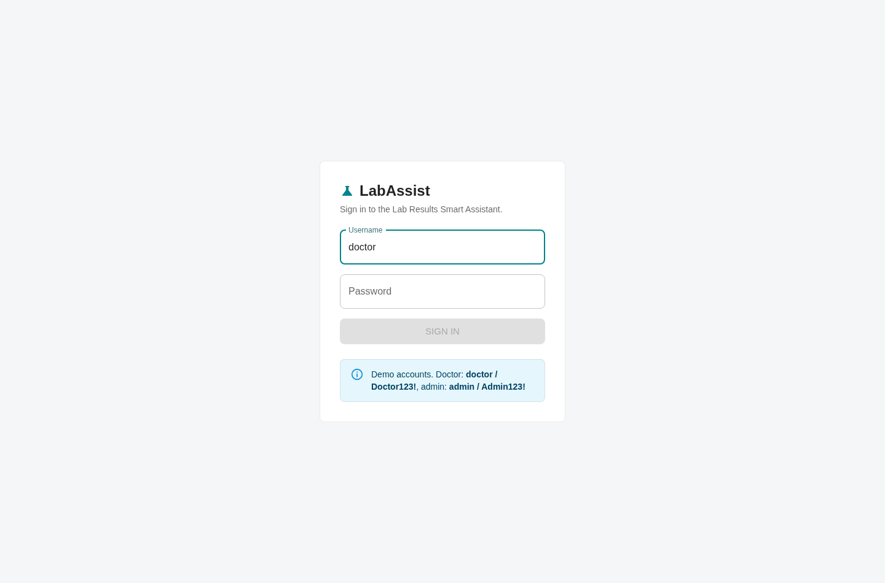
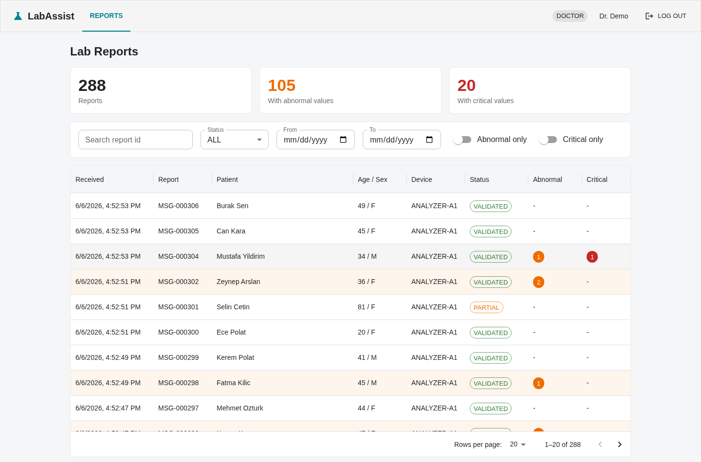
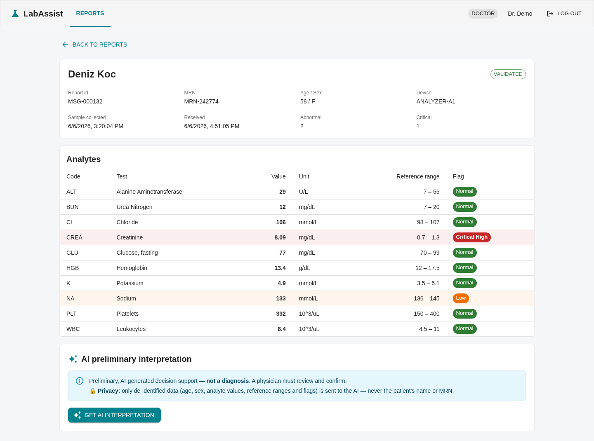
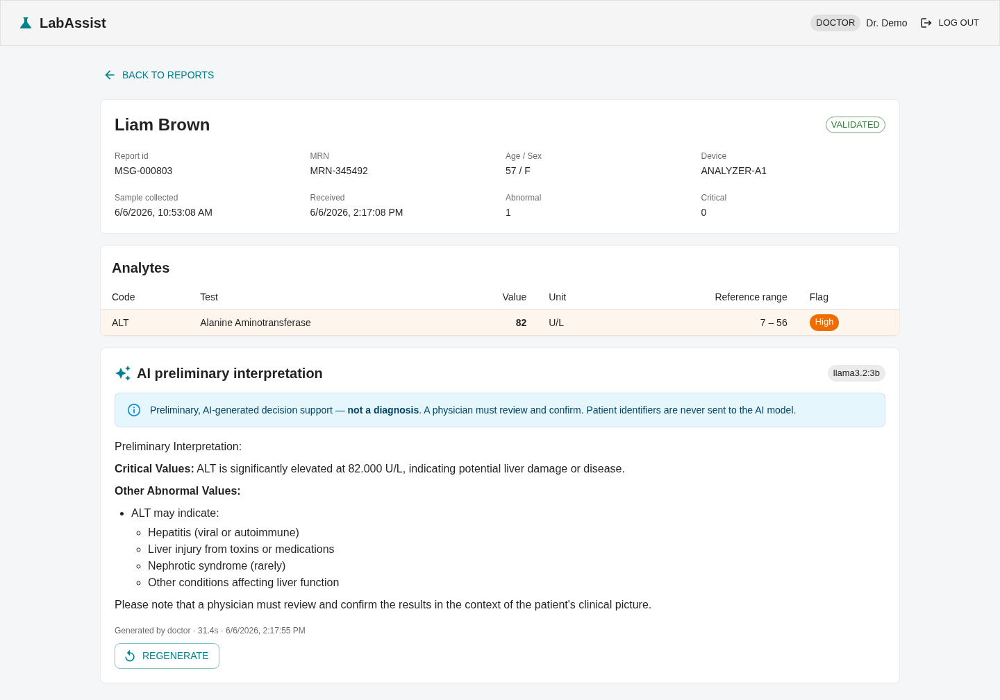
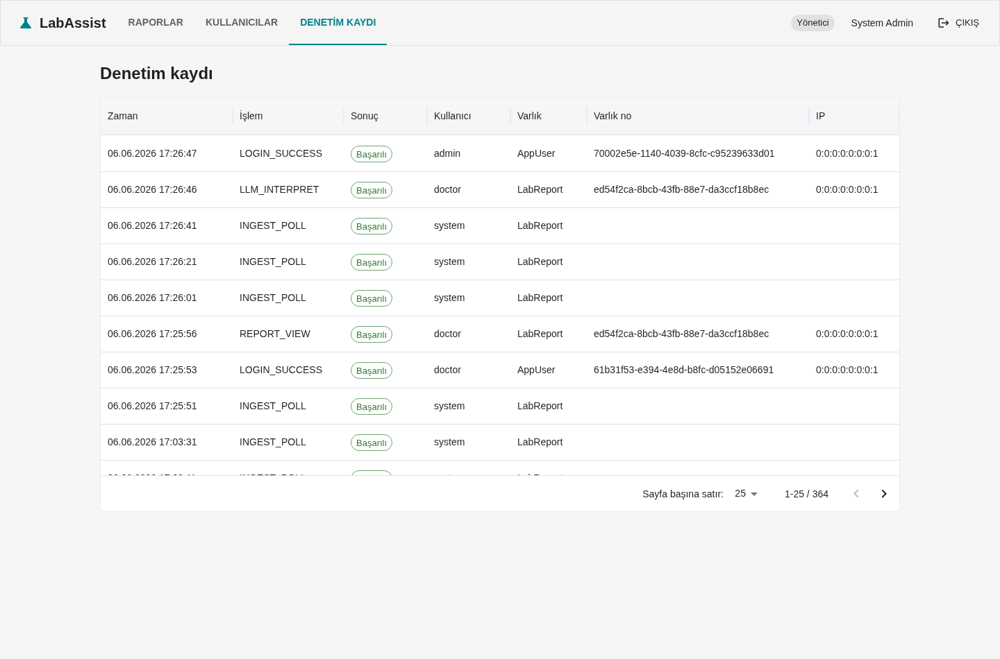
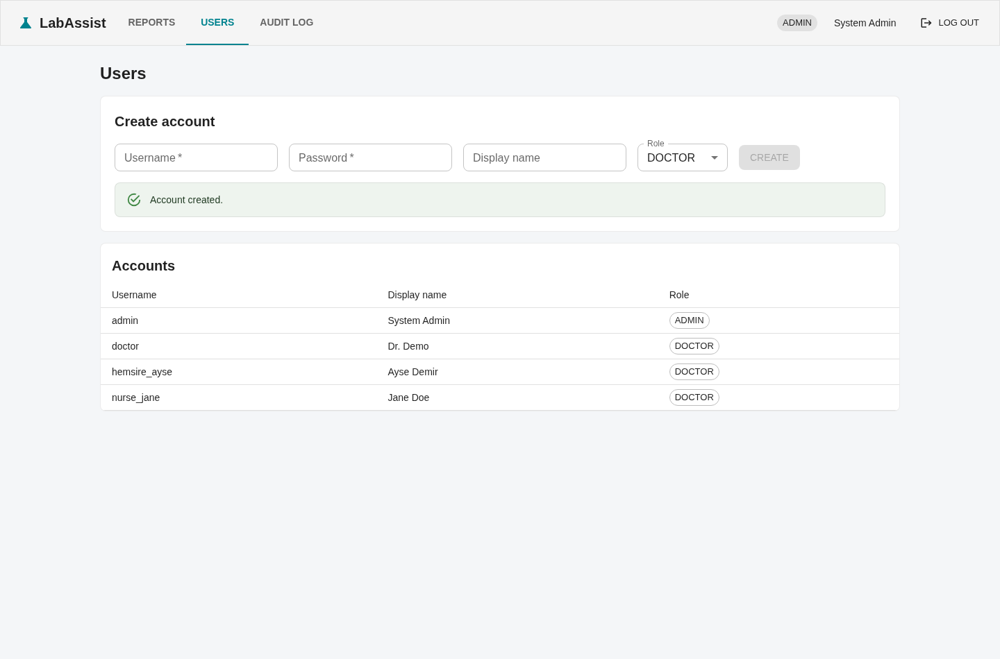

# Usage guide

A step-by-step walkthrough of the doctor's workflow. All data is synthetic.

> The running UI is in **Turkish** (LabAssist is a tool for a Turkish hospital). This guide is in
> English; the screenshots show the actual Turkish interface.

## 0. Start the system

```bash
cp .env.example .env
docker compose up --build
```

Wait until the backend is healthy (the first run also pulls the ~2 GB LLM model), then open
**<http://localhost:5173>**.

## 1. Sign in

Log in with a seeded account (shown on the login screen):

- Doctor — `doctor` / `Doctor123!`
- Admin — `admin` / `Admin123!`

A failed login is rejected with a generic message (no user enumeration) and recorded in the audit
trail.



## 2. Review the report list

The dashboard opens with **summary cards** (total reports, how many carry abnormal values, how many
carry critical values) above a server-paginated table. You can filter by:

- **Abnormal only** / **Critical only** toggles,
- **Status** (`VALIDATED` / `PARTIAL`),
- **received-date range** (From / To),
- **report id** search.

Abnormal rows are tinted amber, **critical** rows red, and per-row chips show the abnormal/critical
counts. Patient names shown here are decrypted on the fly for the authenticated doctor (they are
ciphertext at rest in the database).

> Doctors see only clinically-valid reports. Malformed/`REJECTED` device messages are a
> data-quality concern shown to **admins** only (admins also get a "Rejected" summary card and the
> `REJECTED` status filter).



## 3. Open a report

The detail view shows the patient header and every analyte with its value, unit, **reference range**
and a colour-coded **flag** (green normal, amber low/high, red critical). Out-of-range rows are
highlighted. A `REJECTED` report instead shows why validation failed.



## 4. Ask the AI assistant

Click **Get AI interpretation**. The backend sends a *de-identified* summary (age, sex, values,
ranges, flags — never the name or MRN) to the local LLM and returns a preliminary, non-diagnostic
write-up that leads with critical values and ends recommending physician review. The result is
cached; use **Regenerate** to produce a fresh one.

> On CPU the first call takes ~30–60 s; cached results open instantly.



## 5. Audit log (admin)

Sign in as `admin` and open **Audit log** to see who did what and when — logins, ingestion polls,
report views and LLM requests.



## 6. Manage accounts (admin)

There is no public sign-up (appropriate for a clinical system). An admin provisions accounts under
**Users** — fill in username, password, optional display name and role, then **Create**. New
accounts appear in the list and the action is recorded in the audit log.



## Seeing the different ingestion scenarios

The mock device continuously emits a weighted mix of scenarios, so the list naturally accumulates
normal, abnormal, **critical**, **partial** (missing values) and **rejected** (malformed) reports.
To force a specific scenario from the device directly:

```bash
curl "http://localhost:9090/api/lab-results?scenario=critical" | jq
curl "http://localhost:9090/api/lab-results?scenario=malformed" | jq
```

## Exploring the API

Interactive API docs are at **<http://localhost:8080/swagger-ui.html>**. Authorize with a token from
`POST /api/auth/login` to call the protected endpoints.
